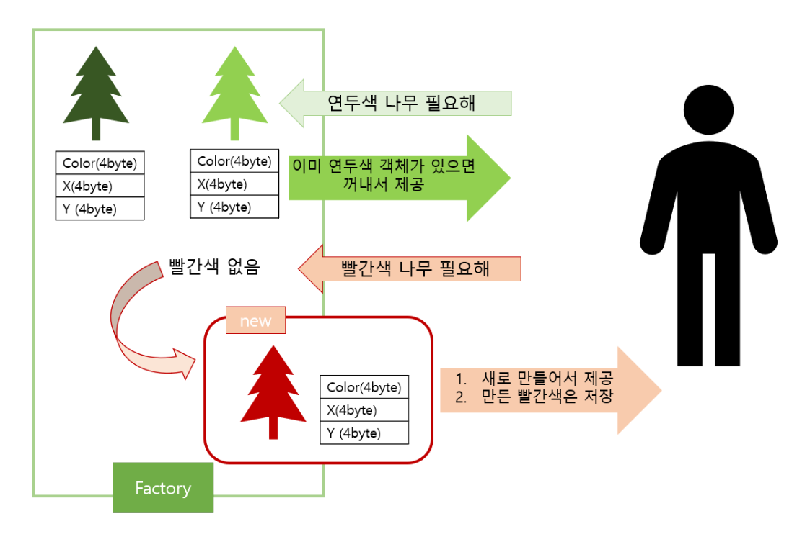

# Flyweight pattern


## What

- 구조 패턴
- 인스턴스 한 개만 가지고 여러개의 가상 인스턴스를 제공하고 싶을 때 사용
- 동일하거나 유사한 객체들 사이에 가능한 많은 데이터를 서로 공유하여 사용하도록 하여 메모리 사용량을 최소화하는 디자인 패턴
- 많은 수의 객체를 생성해야 할 때 사용

**=> 인스턴스를 가능한 한 공유해서 사용함으로써 메모리를 절약하는 패턴**


**Flyweight** -> 공유할 클래스들의 인터페이스 선언

**Flyweight Factory** -> flyweight의 인스턴스를 생성하고 공유함

**Concrete Flyweight** -> flyweight의 내용 정의, 실제 공유되는 객체




참고

https://velog.io/@hoit_98/%EB%94%94%EC%9E%90%EC%9D%B8-%ED%8C%A8%ED%84%B4-Flyweight-%ED%8C%A8%ED%84%B4


## How

### **Flyweight** - 공유할 tree객체

```java
public class Tree {

    // 나무는 아래와 같이 3개 정보를 가지고 있습니다.
    private String color;
    private int x;
    private int y;

    //색상으로만 생성자를 만들어줄게요.
    public Tree(String color) {
        this.color = color;
    }

    public void setX(int x) {
        this.x = x;
    }

    public void setY(int y) {
        this.y = y;
    }

    //나무를 심을 때
    public void install(){
        System.out.println("x:"+x+" y:"+y+" 위치에 "+color+"색 나무를 설치했습니다!");
    }
}
```

### Flyweight Factory - Tree를 제공해줄 TreeFactory

```java
public class TreeFactory {
    //HashMap 자료구조를 활용해서 만들어진 나무들을 관리해볼게요
    public static final HashMap<String, Tree> treeMap = new HashMap<>();
    
   
    public static Tree getTree(String treeColor){
        //Map에 입력받은 색상의 나무가 있는지 찾습니다. 있으면 그 객체를 제공합니다.
        Tree tree = (Tree)treeMap.get(treeColor); 

       //만약 아직 같은 색상의 나무가 Map에 없다면 새로 객체를 생성해 제공합니다.
        if(tree == null){
            tree = new Tree(treeColor);
            treeMap.put(treeColor, tree);
            System.out.println("새 객체 생성");
        }

        return tree;
    }
}
```

### Client

```java
import java.util.Scanner;

public class Main {
    public static void main(String[] args) {
        Scanner scanner = new Scanner(System.in);
        
        System.out.println("원하는 색을 입력해주세요 :)");
        for(int i=0;i<10;i++){
            //나무 색 입력받기
            String input = scanner.nextLine();
            //팩토리에서 나무 하나 공급받기
            Tree tree = (Tree)TreeFactory.getTree(input);
            //나무 x,y 설정하고
            tree.setX((int) (Math.random()*100));
            tree.setY((int) (Math.random()*100));
            //나무 설치하기
            tree.install();
        }

    }
}
```


## Why

어떤 클래스의 인스턴스가  많이 필요하지만 모두 똑같은 방식으로 제어해야 할 때 

- 인스턴스의 수를 줄여 **메모리를 절약**할 수 있음 -> 성능 향상
- 여러개의 가상 객체의 상태를 한 곳에 집중시켜 놓을 수 있음

**=> 불필요한 인스턴스 생성을 최소화하기 때문에, 필요할 때마다 매번 새로운 인스턴스를 생성할 때보다 훨씬 메모리를 적게 사용하고, 빠른 프로그램을 작성할 수 있음**


*Java의 String Constant Pool에 적용됨*

