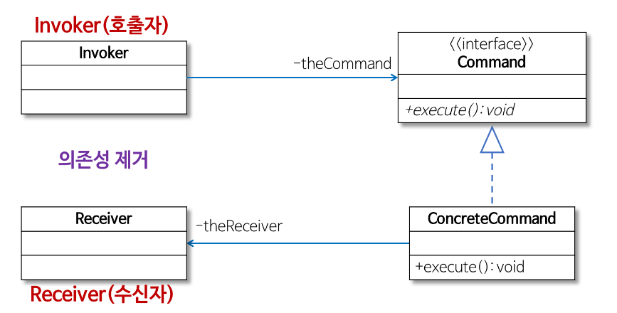
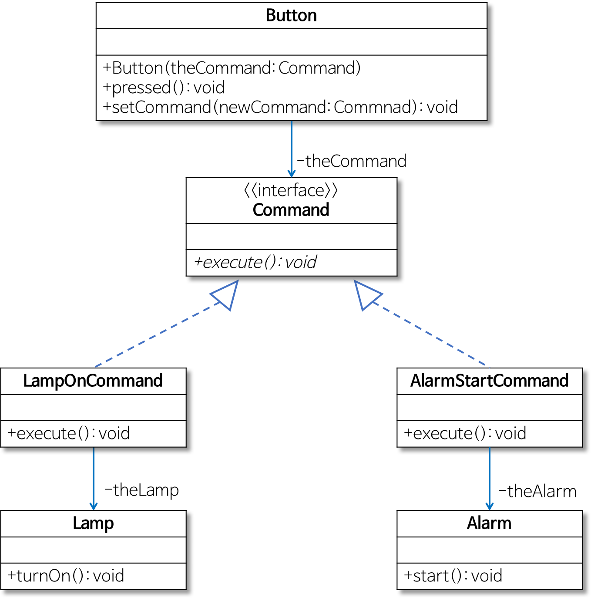

# Command pattern

## What

**커맨드 패턴( Command Pattern )**

커맨드 패턴은 요청을 객체의 형태로 캡슐화 하여 사용자가 보낸 요청을 나중에 이용할 수 있도록 method 이름, 매개변수 등 요청에 필요한 정보를 저장 또는 로깅, 취소할 수 있게 하는 패턴

--> 재사용성이 높은 클래스를 설계하는 패턴

--> 이벤트가 발생했을 때 실행될 기능이 다양하면서도 변경이 필요한 경우 이벤트를 발생시키는 클래스를 변경하지 않고 재사용할 수 있음



--> 어떤 객체(A)에서 다른 객체(B)의 메서드를 실행하려면 그 객체(B)를 참조하고 있어야 하는 의존성이 발생하지만, 커맨드 패턴을 적용하면 의존성을 제거할 수 있음

--> 실행될 기능이 변경되더라도 Invoker 클래스를 수정 없이 사용할 수 있음

- Command - Receiver의 정보 + 실행될 기능(execute)이 들어 있는 객체
- Receiver - 행동을 하는 객체
- Invoker - 호출자, Command 를 저장하고 Receiver에게 기능 실행을 요청함
- Client - Command 객체를 생성, Invoker를 통해 Receiver에게 할 행동을 전달함


## How

1. 클라이언트에서 Command 객체 생성
2. Invoker로 Command 객체 저장
3. 클라이언트에서 Invoker를 통해 행동 요청
4. Receiver 행동


ex) 버튼을 누르면 램프 ON

```java
public class Lamp {
public void turnOn(){ System.out.println("Lamp On"); }
}
public class Button {
private Lamp theLamp;
public Button(Lamp theLamp) { this.theLamp = theLamp; }
public void pressed() { theLamp.turnOn(); }
}
```

```java
public class Client {
public static void main(String[] args) {
  Lamp lamp = new Lamp();
  Button lampButton = new Button(lamp);
  lampButton.pressed();
}
}
```

버튼을 한번 누르면 램프 ON, 두번 누르면 알람 ON

```java
public class Alarm {
  public void start(){ System.out.println("Alarming"); }
}
```

```java
enum Mode { LAMP, ALARM };
// Button 클래스의 코드를 수정
public class Button {
  private Lamp theLamp;
  private Alarm theAlarm;
  private Mode theMode;
  // 생성자에서 버튼을 눌렀을 때 필요한 기능을 인지로 받는다.
  public Button(Lamp theLamp, Alarm theAlarm) {
   this.theLamp = theLamp;
   this.theAlarm = theAlarm;
  }
  // 램프 모드 또는 알람 모드를 설정
  public void setMode(Mode mode) { this.theMode = mode; }
  // 설정된 모드에 따라 램프를 켜거나 알람을 울림
  public void pressed() {
   switch(theMode) {
   case LAMP: theLamp.turnOn(); break;
   case ALARM: theAlarm.start(); break;
   }
 }
}

```

--> 버튼 클래스의 코드를 수정해야하므로 재사용하기 어려움


> Command Pattern 이용

실행될 기능을 캡슐화

Button 클래스의 pressed 메서드에서 구체적인 기능(램프 켜기, 알람 동작 등)을 직접 구현하는 대신 버튼을 눌렀을 때 실행될 기능을 Button 클래스 외부에서 제공받아 캡슐화해 pressed 메서드에서 호출
--> Button 클래스 코드를 수정하지 않고 그대로 사용할 수 있다.




Button 클래스는 미리 약속된 Command 인터페이스의 execute 메서드를 호출
램프를 켜는 경우에는 theLamp.turnOn 메서드를 호출하고, 알람이 동작하는 경우에는 theAlarm.start 메서드를 호출하도록 pressed 메서드 수정
LampOnCommand 클래스에서는 Command 인터페이스의 execute 메서드를 구현해 Lamp 클래스의 turnOn 메서드(램프 켜는 기능)를 호출
마찬가지로 AlarmStartCommand 클래스는 Command 인터페이스의 execute 메서드를 구현해 Alarm 클래스의 start 메서드(알람이 울리는 기능)를 호출


```java
public interface Command { public abstract void execute(); }
```

```java
public class Button {
private Command theCommand;
// 생성자에서 버튼을 눌렀을 때 필요한 기능을 인지로 받는다.
public Button(Command theCommand) { setCommand(theCommand); }
public void setCommand(Command newCommand) { this.theCommand = newCommand; }
// 버튼이 눌리면 주어진 Command의 execute 메서드를 호출한다.
public void pressed() { theCommand.execute(); }
```


```java
public class Lamp {
public void turnOn(){ System.out.println("Lamp On"); }
}
/* 램프를 켜는 LampOnCommand 클래스 */
public class LampOnCommand implements Command {
private Lamp theLamp;
public LampOnCommand(Lamp theLamp) { this.theLamp = theLamp; }
// Command 인터페이스의 execute 메서드
public void execute() { theLamp.turnOn(); }
}
```

```java
public class Alarm {
public void start(){ System.out.println("Alarming"); }
}
/* 알람을 울리는 AlarmStartCommand 클래스 */
public class AlarmStartCommand implements Command {
private Alarm theAlarm;
public AlarmStartCommand(Alarm theAlarm) { this.theAlarm = theAlarm; }
// Command 인터페이스의 execute 메서드
public void execute() { theAlarm.start(); }
}
```

```java
public class Client {
public static void main(String[] args) {
  Lamp lamp = new Lamp();
  Command lampOnCommand = new LampOnCommand(lamp);
  Alarm alarm = new Alarm();
  Command alarmStartCommand = new AlarmStartCommand(alarm);

  Button button1 = new Button(lampOnCommand); // 램프 켜는 Command 설정
  button1.pressed(); // 램프 켜는 기능 수행

  Button button2 = new Button(alarmStartCommand); // 알람 울리는 Command 설정
  button2.pressed(); // 알람 울리는 기능 수행
  button2.setCommand(lampOnCommand); // 다시 램프 켜는 Command로 설정
  button2.pressed(); // 램프 켜는 기능 수행
}
}
```

Command 인터페이스를 구현하는 LampOnCommand와 AlarmStartCommand 객체를 Button 객체에 설정
Button 클래스의 pressed 메서드에서 Command 인터페이스의 execute 메서드 호출
즉, 버튼을 눌렀을 때 필요한 임의의 기능은 Command 인터페이스를 구현한 클래스의 객체를 Button 객체에 설정해서 실행할 수 있음

-->  Command 패턴을 이용하면 Button 클래스의 코드를 변경하지 않으면서 다양한 동작을 구현할 수 있게 된다.


## Why


- 요청부와 동작부를 분리시켜주기 때문에 시스템의 결합도를 낮출 수 있으며, 각 객체들이 수정되어도 다른 객체가 영향을 받지 않음
- 클라이언트와 INVOKER 클래스 간의 의존성이 제거됨


+

단점 

리시버 및 리시버의 동작이 추가된다면 그 동작에 대한 클래스를 만들어야 하기 때문에, 다소 많은 잡다한 클래스들이 추가된다는 단점이 있습니다.
