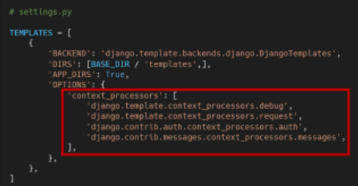

# Authentication system

- Authentication (인증) - 신원확인, 사용자가 자신이 누구인지 확인하는 것
- Authorization (권한 ,허가) - 권한 부여, 인증된 사용자가 수행할 수 있는 작업을 결정

## 쿠키, 세션

### HTTP

HTML문서와 같은 데이터들을 가져올 수 있게 해주는 프로토콜

웹에서 이루어지는 모든 데이터 교환의 기초

클라이언트 - 서버의 프로토콜

- 비연결지향 - 서버는 요청에 대한 응답을 보낸 후 클라이언트와 연결을 끊음
- 무상태 - 연결을 끊는 순간 클라이언트와 서버 간의 통신이 끝나며 상태 정보가 유지되지 않음, 클라이언트와 서버가 주고 받는 메세지들은 서로 완전히 독립적임

**따라서 클라이언트와 서버의 지속적인 관계를 유지하기 위해 쿠키와 세션이 존재함**

### 쿠키

서버가 사용자의 웹 브라우저에 전송하는 작은 데이터 조각

사용자가 웹사이트를 방문할 경우 해당 웹사이트의 서버를 통해 사용자의 컴퓨터에 설치되는 작은 기록 정보 파일

- 브라우저(클라이언트) 는 쿠키를 로컬에 key-value의 데이터 형식으로 저장
- 쿠키를 저장해 놓았다가 동일한 서버에 재 요청시 저장된 쿠키를 함께 전송

HTTP쿠키는 상태가 있는 세션을 만들어 줌

쿠키는 두 요청이 동일한 브라우저에서 들어왔는지 아닌지를 판단할 때 주로 사용

- 이를 이용해 사용자의 로그인 상태를 유지할 수 있음
- 상태가 없는 HTTP 프로토콜에서 상태 정보를 기억 시켜 줌

**--> 웹 페이지에 접속하면 요청한 웹 페이지를 받으며 쿠키를 저장하고, 클라이언트가 같은 서버에 재 요청 시 요청과 함께 쿠키도 전송**

### 쿠키의 사용 목적

1. 세션 관리

   로그인, 아이디 자동 완성, 공지 하루 안보기, 팝업 체크, 장바구니

2.  개인화

    사용자 선호, 테마 등의 설정

3.  트래킹

​        사용자의 행동을 기록 및 분석

### 세션(Session)

**사이트와 특정 브라우저 사이의 상태를 유지시키는 것** - 쿠키는 세션 정보를 가지고 있음

클라이언트가 서버에 접속하면 서버가 특정 세션 아이디를 발급하고 클라이언트는 발급 받은 세션 아이디를 쿠키에 저장

- 클라이언트가 다시 서버에 접속하면 요청과 함께 쿠키를 서버에 전달
- 쿠키는 요청될 때마다 서버에 함께 전송되므로 서버에서 세션 아이디를 확인해 알맞은 로직을 처리

아이디는 세션을 구별하기 위해 필요하며 쿠키에는 아이디만 저장 - 아이디에 대한 값은 서버가 갖고 있음

** 로그아웃은 세션 삭제

### 쿠키 lifetime

수명 주기에 따라 두가지 방법으로 정의

- session cookies

​	현재 세션이 종료되면 삭제 - 현재 브라우저가 종료되면 끝남

- persistent cookies

​	expires 속성에 지정된 날짜 또는 max-age 속성에 지정된 기간이 지나면 삭제

### Session in Django

Django의 세션은 미들웨어를 통해 구현됨

Djangi는 database-backed sessions 저장 방식을 기본 값으로 사용

Django는 특정 session id를 포함하는 쿠키를 사용해서 각각의 브라우저와 사이트가 연결된 세션을 알아냄

모든 쿠키를 세션으로 써서 db에 저장하면 서버에 부하가 걸릴 수 있음 따라서 브라우저 저장/ db저장 적절히 나눔

** 미들웨어는 http요청과 응답 처리 중간에서 작동하는 시스템

미들웨어를 거쳐 해당 url에 등록되어 있는 view로 연결해주고 http 응답 역시 미들웨어를 거침

쿠키 - 브라우저한테 서버가 뭔가를 남길 수 있는 수단

실시간으로 정보를 받아오는 법 - Web socket

리퀘스트를 보내지 않아도 됨

## 로그인

로그인은 session을 create하는 로직

### AuthenticationForm

사용자 로그인을 위한 form, request를 첫번째 인자로 받음 , 그냥 폼

 ### login()

​	`login(request,user,backend = None)`

`def login()`(view) 함수와 혼동 방지를 위해 `auth_login()` 으로 씀

### context processor

템플릿이 랜더링 될 때 자동으로 호출 가능한 컨텍스트 데이터 목록

- Users - 현재 로그인한 사용자를 나타내는 auth.Users 인스턴스  - {{user}} 에 저장 됨

### 로그인 사용자에 대한 접근 제한

- is_authenticated

​		user에 대해 항상 `True`, AnonymousUser 면 `False`

​		권한과는 관련이 없으며, 사용자가 활성화 상태인지, 유효한 세션을 갖고 있는지 확인 x

- @ login_required

  로그인 되어있으면 정상적으로 view 함수 실행

  next 경로로 이동

  

## 로그아웃

session delete

### logout()

`logout(request)`

session data를 서버의 DB에서도 지우고,  클라이언트의 쿠키에서도 session id 삭제

왜 쿠키에서도 삭제 ? 다른 사람이 동일한 웹 브라우저를 사용해 로그인하고 이전 사용자의 세션 데이터에 엑세스 하는 것 방지

## 회원가입

### UserCreationForm

3개의 필드 - username, password1, password2

모델폼

## 회원탈퇴

DB에서 user삭제

request.user.delete()

## 회원정보 수정

### UserChangeForm

모델폼

`UserChangeForm(instance = request.user)`

위의 form은 admin 사용자에게만 보여야하는 필드가 다 보이기 때문에 따로 커스텀 필요

### CustomUserChangeForm()

form.py 에서 커스텀

모델은 UseChangeForm 상속 

**Meta**

- model = get_user_model()

- field = ('원하는 필드들')

## 비밀번호 변경

### PasswordChangeForm

이전 비밀번호 입력하여 비밀번호를 변경할 수 있도록 함

이전 비밀번호 입력 없이 비밀번호를 설정할 수 있는 SetPasswordForm(form)을 상속받는 서브 클래스

user인자가 필요함

### 암호 변경 시 세션 무효화 방지

`update_session_auth_hash(request,user)`

원래는 비밀번호 변경되면 로그아웃 됨 - 기존 세션과의 회원 인증 정보와 일치하지 않기 때문

따라서 비밀번호를 바꿔도 로그아웃 되지 않도록 새로운 password hash로 session 업데이트

