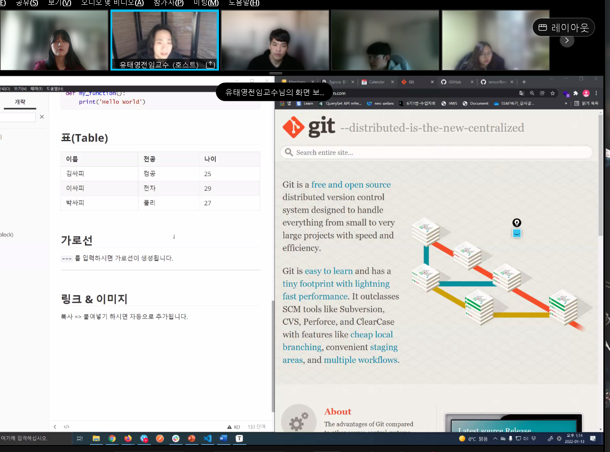

# Markdown 학습하기
## 제목
가장 큰 제목부터 ~6번째로 큰 제목까지 존재

#의 개수로 제목의 중요도를 지정

## 목록
순서가 있는 목록(ordered list)과 순서가 없는 목록(unordered list)가 있다.

### 순서 없는 목록
-혹은 *를 앞에 붙이고 띄어쓰기

-python
-js
-web
-jango
-vue

### 순서 있는 목록
1을 쓰고 띄어쓰기

1. md학습

2. git기초학습

3. github학습

 ## 강조(Emphasis)

   글자의 스타일을 지정

1. 기울임:` *`로 감싼 글자들을 *기울어 집니다*
2. 굵게:` **`로 감싼 글자들은 **굵어집니다.**
3. 취소: `~~`로 감싼 글자들은 ~~취소선이 생깁니다.~~
4. 인라인코드: 백틱으로 감싼 글자들은 `코드처럼 표시됩니다`


 ## 코드블럭(Code block)

백틱 3개로 감싼 블럭은 코드 출력용입니다.

```python
def my_funtion():
	print('Hello world')
```

## 표(Table)

| 이름   | 전공       | 나이 |
| ------ | ---------- | ---- |
| 지수경 | 전자공학과 | 25   |
| 김싸피 |            |      |

## 가로선

'---'을 입력하면 가로선이 생성됩니다.

---

## 링크 & 이미지

복사 붙여넣기 하면 자동으로 추가됩니다.



## 수식(Latex)

> 원래 마크다운은 지원하지 않으나, Typora가 추가적으로 지원하는 기능

$$
d
$$
