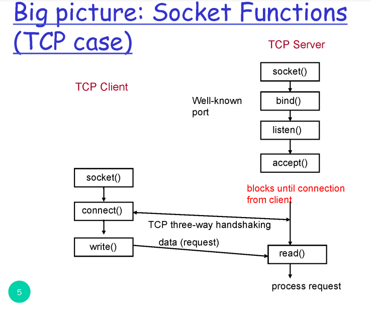

# Application layer

application - HTTP

transport - TCP/UDP

network - IP

link - Wifi, LTE/3G, 이더넷

가장 기본적인 application이 웹브라우저

## Client - Server 

다른 컴퓨터에 위치한 프로세스를 지칭하는 인덱스 - ip & port

server - 고정된 ip 주소를 가지고 있음

client - dynamic ip adress

app의 입장에서 tranport에서 제공해줬으면 하는 서비스

data integrity - 데이터 유실 없이 도착 --> 이것만 제공(TCP)

timing - 특정 시간 내에 도착(시간)

throughput - 용량(양)

security - 보안

나머지는 app에서 해결해야함

## HTTP

hypertext transfer protocol

- request - response

- TCP를 사용함

  - non-persistent

    메세지 주고 받고 끝

  - persistent

​				연결(TCP connection) 을 계속 유지하고 사용, 웹브라우저는 persistent HTTP

- stateless - 요청 처리하고 끝, 상태를 기억하지 않음

## socket

클라이언트 프로세스와 서버 프로세스의 통신을 위한 api

TCP socket (socket stream) / UDP socket (socket dgram) 선택해서 사용

### server

- socket() -create a socket

  parameter -` int domain`, `int type`,` int protocol`

  type에서 TCP/UDP를 결정함

  실행하면 socket의 id값을 return함

- bind() - bind a socket to a local IP address and port number

- listen() - socket을 어떤 용도로 사용하겠다, 최대 몇개까지 처리

- accept() - client의 요청을 기다리겠다

​		클라이언트의 요청이 들어올 때 까지 block

​		요청이 들어오면 return - client의 IP, port number

### client

- socket()

- connect()

​		 parameter -  서버의 주소, 포트 넘버

연결되면 read(), write() 반복

마지막에 close()

socket을 왜쓰는가

오버헤드를 줄이기 위해 (채팅 같은 것)

socket을 사용하면 클라이언트의 요청 전에  보낼 수 있어,

overhead - 목표와 연관되어 있는 것 외에 낭비되는 자원

