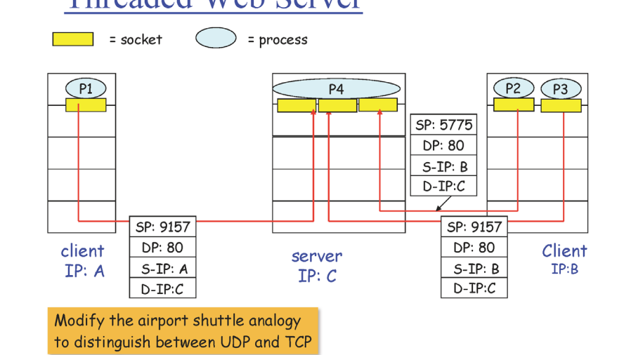
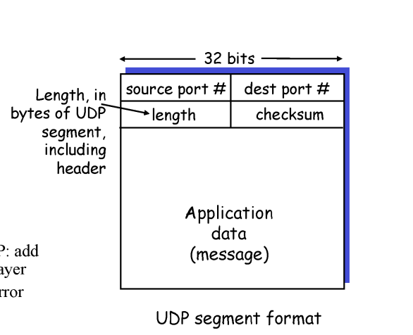

# Transport layer

application layer의 전송단위인 message가 socket을 통해 내려와서 transport layer의 전송단위인 segment에 담김


## Multiplexing / demultiplexing

프로세스에서 보낸 메세지를 알맞은 프로세스로 전달해주는 것

TCP UDP 모두 공통적으로 제공

- multiplexing (보내기)

```
  Application -> transport (input 여러개 - sender)
```

- demultiplexing(받기)

 		transport -> application (output여러개 - receiver)


segment = header(부가정보) + data(message)

> UDP

connection이 없음 (1:1 mapping이 아님) - port번호만 보고 전송(header에 적힘)

>  TCP

 socket사이에 connection이 있음 (1:1 mapping)



TCP socket들은 서로 다른 포트 번호를 가진다기보다는 고유의 id(index) 를 가짐

source port, source id, dest port, dest port, dest id


## UDP

 

header size를 줄이기 위해 필요한 정보만 넣는 것이 중요! balance를 잘 맞춰야함

- port - multi/demultiplexing을 위해

- length

- checksum - 전송 중 error 발생 여부를 확인 가능함

  -> UDP는 유실 가능성은 있지만 엉뚱한 데이터를 전달하지 않음


## TCP

