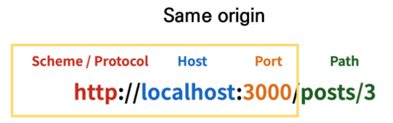

# Vue+API

## CORS

기존 - 동일 출처에서 불러온 문서/스트립트만 받아줌 (SOP), 클라이언트가 막아버림

추가 HTTP 헤더를 사용해 다른 출처의 자원에 접근 할 수 있는 권한 부여

다른 출처의 리소스를 불러오려면 그 출처에서(서버) 올바른 CORS Header 포함한 응담을 해야함

### why cors

- 브라우저&웹 애플리케이션 보호 - 악의적인 사이트의 데이터를 가져오지 않도록 응답으로 받는 자원에 대한 최소한의 검증, 서버는 정상적으로 응답하지만 브라우저에서 차단
- server의 자원 관리

### `Acess-Control-Allow-Origin: *`

