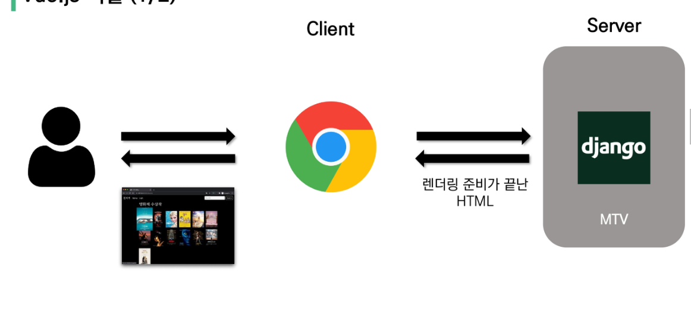
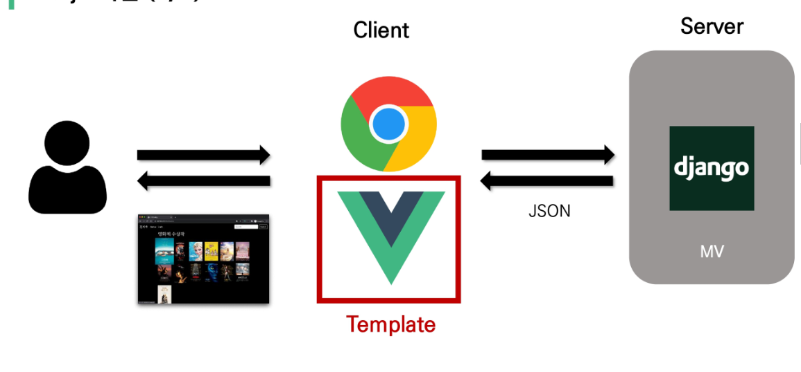

# Vue.js

프론트엔드 디벨롭먼트

HTML, CSS, Jvascript를 활용해 데이터를 볼 수 있게 만들어 줌

이 작업을 통해 사용자는 데이터와 상호작용 할 수 있음

## SPA

single page application

현재 페이지를 동적으로 렌더링함으로써 사용자와 소통하는 웹 애플리케이션

단일 페이지로 구성, 최초에만 페이지를 다운로드 하고 이후에는 동적으로 DOM 구성

## CSR

client side rendering

서버에서 화면을 구성하는 SSR 방식과는 달리 클라이언트에서 화면을 구성

- 장점

​	서버와 클라이언트 간 트래픽 감소 - 웹 애플리케이션에 필요한 모든 정적 리소스를 최초에 한 번 다운로드 후 필요한 데이터만 갱신

​	사용자 경험 향상

- 단점

​	SSR에 비해 전체 페이지 최종 렌더링 시점이 느림

## SSR

server side rendering     ex)장고

서버가 최종본(HTML완성) 을 다 만들고 브라우저로 보냄

- 장점

  초기 구동 속도가 빠름

  SEO(검색엔진최적화)에 적합 - DOM에 이미 모든 데이터가 있어서

- 단점

​		모든 요청마다 새로운 페이지를 구성하여 전달

-- 두 방식의 차이는 최종 HTML 생성 주체가 누구인가에 따라 결정 -> 실제 브라우저에 그려질 HTML을 서버가 만들면 SSR, 클라이언트가 만들면 CSR

## Vue

Vanilla JS vs Vue.js

바닐라는 하나하나 다 명령을 지정해 줘야함

뷰는 DOM과 Data가 연결되어 있고 data변경하면 dom은 알아서 변경

우리가 신경 써야 할 것은 data에 대한 관리 (dx향상(developer experience))

-> 뷰는 돔(html)과 데이터(모델= 자바스크립트 오브젝트)의 중재자

## basic syntax

### view instance

- el - vue에 연결할 기존 DOM요소, CSS선택자 or HTML element
- data - vue의 데이터 객체
- methods - 함수 , 화살표 함수 사용 x

## template syntax

`v-__ : ____`

`v-text = "message"`

`v-html="message"` - 거의 안씀 (위험)

`
message
` - " "안의 값이 true일 때 값 출력

`v-if = "  "` 

`v-else-if = "  "`

-> show 와의 차이점은 if는 false일 때 아예 랜더링을 하지 않음, show는 그냥 화면에서 hidden

따라서 계속 변경되는 요소라면 show가 유리

`v - for = "item in items"`

`v - for = "(item,idx) in items"`

`v-bind` 기본 속성과 vue연결 --> `:` 로 축약 가능

`
`  - isRed가 true면 class에 active 적용

`v-for` 와 key bind 무조건

이벤트 발생

`v-on:click="콜백함수이름"` --> `@click` 로 축약  

`@submit`

`@submit.prevent`

`@ketup`

`v-model`  form의 input 요소와 vue data를 연결해줌(양방향) 

## computed & methods

computed는 계산된 값
