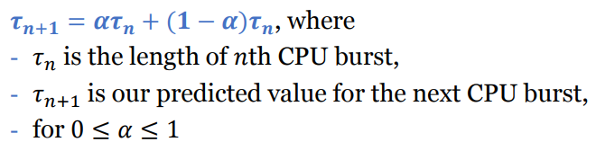

# Scheduling Algorithms

## SJF 

- **next CPU burst time 예측**

SJF로 하면 next CPU burst time 알아야 하는데 알 수 없어서 예측해야함

과거 cpu burst 값으로 예측 - exponential average구함

--> 최근 측정한 값에 더 가중치를 둠

- preemptive or nonpreeptive 

​	더 빠른 프로세스가 ready queue에 오면 기존 프로세스를 중지할지(preemptive) 기다릴지(nonpreemptive)

**SRTF (shortest remaining time first)-> preemptive SJF** 

시간이 더 짧음

## RR scheduling

round - robin

preemptive FCFS with a time quantum (시분할)

정해진 시간동안만 실행하고 다음 프로세스 실행

 time quantum은 보통 10~100 ms - 적절하게 설정해줘야함

만약, CPU burst > one time quantum -> 인터럽트 발생, 레디큐로 들어가서 대기

preemptive 함

## Priority-base Scheduling

우선순위 부여

SJF도 priority base scheduling (CPU burst time을 기준으로 우선 순위 부여)

preemptive or non-preemptive

starvation(무한정대기) 문제 해결을 위해 **aging**

--> 대기 시간이 길어지면 우선순위를 높여줌

## Multi-level queue(MLQ) Scheduling

## Tread Scheduling

## Real-Time CPU Scheduling

- soft realtime
- hard realtime - 반드시 deadline안에 실행되어야 함 --> 우선순위 부여해주기

