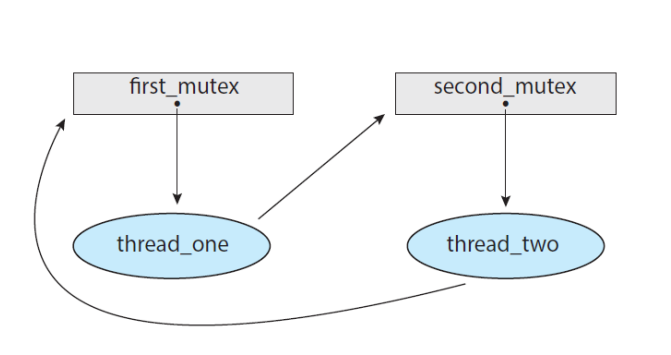
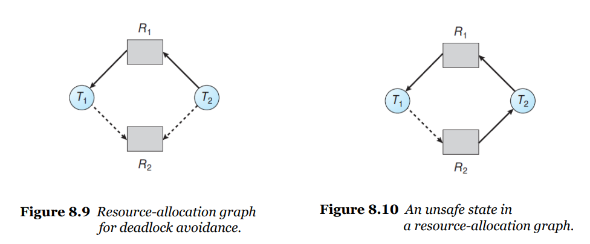

# 데드락의 이해

## Deadlocks

ready queue에 있는 (대기상태) 프로세스들이 서로 이벤트를 주기를 기다리고 있는 상태

웨이팅 상태에서 바뀌지 못함

### 데드락 발생의 네가지 조건

1. Mutual Exclusion - 반드시 하나의 resource는 non-sharble (상호배재)
2.  Hold and Wait - 점유 대기(resource를 들고 대기하고 있는 상태)
3. No Preemption - resource를 못 뺐으니까
4. Circular Wait - 순환 대기

### RAG

resouce allocation graph

RAG 그래프를 통해 데드락 발생을 이해할 수 있음

T > R - request edge (T가 R의 자원을 요구)

R > T - assignment edge (R의 자원이 T에 할당)

사이클 X - 데드락X

데드락 O

데드락 X - T4는 자원을 쓰고 반납 가능

사이클이 없으면 데드락 없음

사이클 있으면 데드락 있을 수도 있고 없을 수도 있고

### 데드락을 다루는 방법

1. ignore
2. prevention - 예방 (거의 불가능) or aviod (뱅커 알고리즘)
3. detect and recover

## Deadlock preverntion

데드락 발생의 4가지 조건 중 적어도 하나는 충족하지 못하도록

- Mutual Exclusion  - 모든 리소스를 공유 가능하도록

​		이런 경우에는 애초에 데드락 발생이 안되니까 고려 x

- Hold and Wait - 자원을 요청 할 때는 들고 있는 자원을 다 놓고 요청하기

  실용적이지 않음

- No Preemption - 자원 뺏어버리기

​		일반적으로는 적용 불가능

- Circilar Wait  - 자원에 순서 부여하기

  때때로 실용적, starvation의 위험이 높아짐

--> prevention 보다는 avoid 가 낫다

# 데드락과 뱅커 알고리즘

## Deadlock Avoidance

요청이 왔을 때 데드락이 예상되면 wait

-> 리소스가 어떻게 요청되는지 알아야함

최대 자원 개수를 알고 있어야함

available, allocated 자원

- Safe State

  각 쓰레드에 맥시멈까지 어떤 리소스를 할당할 수 있는 상태

  쓰레드 실행 순서에 따라서 자원을 모두 할당해 줄 수 있는 safe sequence를 찾아야함

  

unsafe 상태에서는 데드락 발생할 수도 있고 안할 수도 있지만 safe에서는 발생할 일이 없기 때문에 항상 safe상태에 있게 해줌

시스템 초기에는 항상 safe state

RAG에 claim edge를 넣어 사이클 발생 여부 예상

리소스가 두개이상이면 사이클 있어도 데드락 발생 안함(예상 불가능)

--> 뱅커 알고리즘 적용하기

## Banker's Algorithm

쓰레드 개수 n개 리소스 타입의 개수 m

available - available 한 리소스 타입을 가지고 있는 벡터의 수

max - 각 쓰레드가 앞으로 요청할 리소스 인스턴스의 최대 개수

allocation - currently allocated 된 리소스 개수

need - 앞으로 요청할 리소스

### Safety Algorithm

### Resource-Request Algorithm

## Deadlock Detection

avoid는 절대로 데드락이 걸리면 안되는 시스템인 경우 말고는 부담

데드락 detection 후 recover

