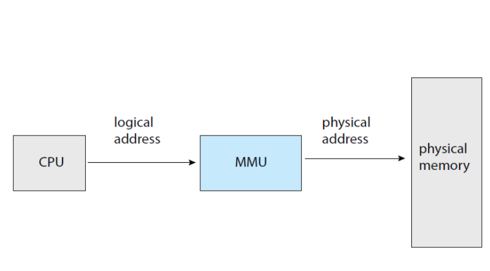
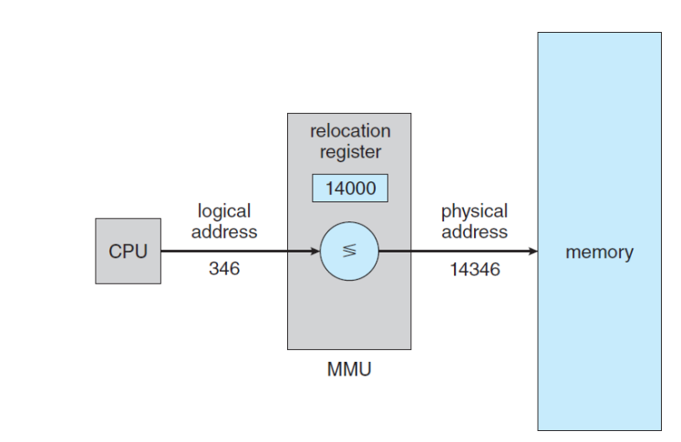
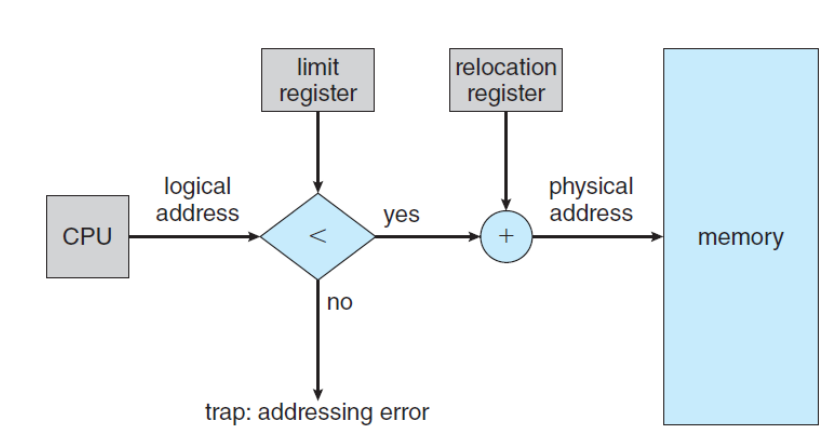
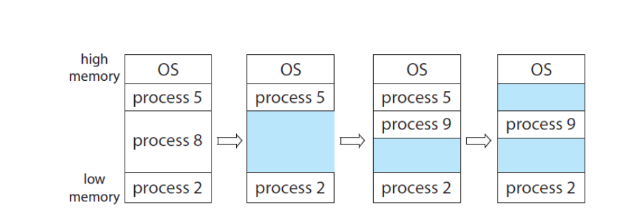

# 주메모리의 관리

프로세스는 실행중인 프로그램 - > 메인메모리에 프로그램이 로드된 상태

메모리는 바이트의 배열, 주소를 갖고 있음

- Memory space

  각 프로세스가 메모리 공간을 차지함

  base register / limit register 를 통해 주소 범위를 결정할 수 있음

  

  

- protection of memory space

  주소 범위를 벗어나면 trap을 일으킴

  

- Address Binding

우리가 `int a` 를 하면 (symbolic) , 컴파일러가 알아서 a 위치 지정 (relocatable adress 에 binding)

a를 실행시키기 위해 메모리에 가져오면 process가 됨 (프로그램이 메모리에 로딩되어야 physical adress확보)

linker 나 loader가 relocatable address -> absolute address(physical)

- Logical address  / Physical address

Logical address - CPU에서 생성된 어드레스, 물리적인 어드레스와는 관련이 없음

Physical address - 특정 레지스터에 mapping

- MMU

​		Memory management unit

​	로지컬 어드레스 -> 피지컬 어드레스

- Dynamic loading

​	메모리 주소 공간을 효율적으로 사용하기 위해 필요할때만 로딩

- Dynamic linking

​	DLL - Dynamically linked libraries

프로그램이 실행 되는 중에 링크되는 시스템 라이브러리

## Contiquaous Memory Allocation

연속메모리 할당 - 메모리를 할당할 때 user process 를 통째로 로딩

- memory protection

  영역만 지정해주면 돼서 간단함

  

- Memory allocation

​	

프로세스의 크기가 다양해서 hole이 생김

- hole에 할당하는 3가지 방법

	1. first fit - 크기가 충분한 홀 중 첫번째 홀에 할당
	1. best-fit - 크기가 충분한 홀 중 가장 작은 것에 할당
	1. worst- fit - 가장 큰 홀에 할당

- Fragmentation

external - 메모리가 쪼개짐 -> 조그만 홀이 여러개 생김

internal - 똑같은 크키로 메모리를 쪼개서 할당했을 때 생기는 hole

--> 단편화 문제를 해결해 줘야 함

