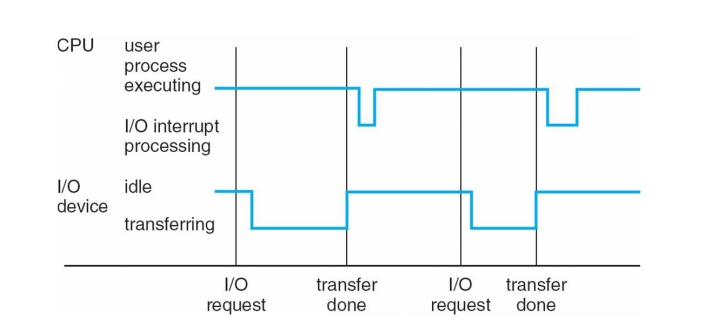
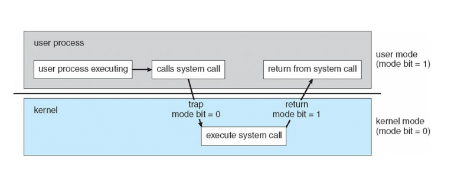
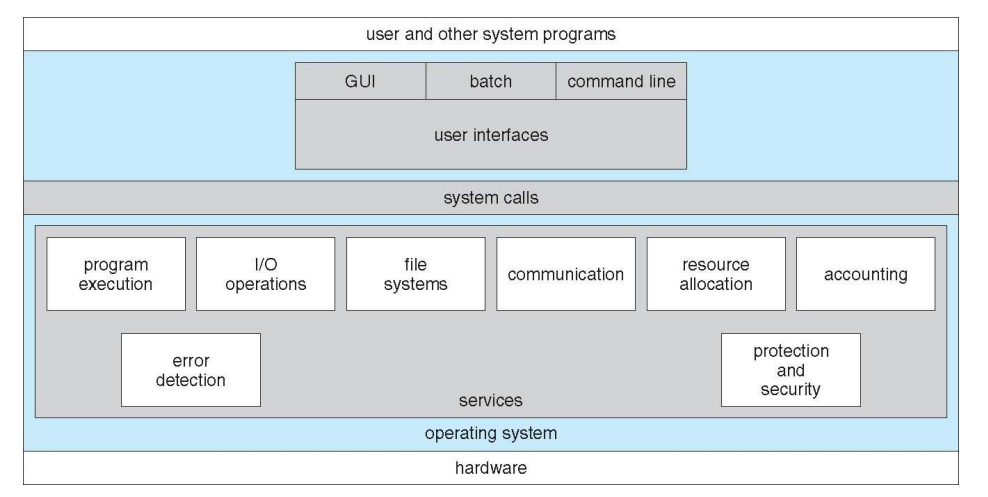

# OS

## Operating System

하드웨어와 어플리케이션 사이에 있는 시스템 소프트웨어  - 운영체제를 통해 하드웨어에서 앱 실행

컴퓨터 시스템을 운영하는 소프트웨어

컴퓨터에서 항상 실행중인 프로그램

- 컴퓨터의 정의 - 정보를 처리하는 기계 

  - 정보란?? 불확실한 상황을 측정해서 수치적으로 표현한 것

    ​                정보의 최소단위 - bit, 정보의 처리- 정보의 상태 변환(0에서1로)

    ​                정보의 저장 - 플립-플롭, 전송 - 데이터버스

  - 프로그램 - 명령어들의 집합

  

## 목적

- 사용을 편리하게 - Low level function 제공
- sharing - 프로세서 동시 실행될 때 CPU memory들의 여러 프로세스를 sharing
- 잘못된 사용 방지 - Low level function은 다 제공하니까 건드릴 이유 x

모든 컴퓨터 시스템에는 os가 들어감 - 프로그램이 실행중이면 다 컴퓨터 시스템 

컴퓨터 시스템은 메모리와 레지스터가 명령어를 실행하며 동작함  -명령어를 실행할 때 마다 스테이트(메모리와 레지스터의 상태)가 바뀜

 

ISA - 모든 컴퓨터는 자기만의 언어(기계어) 를 가짐 x86, ARM

API - 프로그램에서 라이브러리 블러오기

## computer system organization

### bootstrap program

컴푸터가 켜질 때 처음 동작하는 프로그램, 운영체제를 메모리에 로딩

### Interrupts

cpu가 동작을 실행하다가 i/o device 에서 온 신호 처리 (시스템 버스로 신호 전송)

## Kernel

A kernel is the core of operating system that is running at all times on the computer.

운영체제(os)의 심장이자 OS를 규정짓는 매우 중요한 부분. 하드웨어의 자원을 자원이 필요한 프로세스에 나눠주고, 프로세스 제어(태스크 매니저), 메모리 제어, 프로그램이 운영체제에 요구하는 system call 등을 수행하는 부분으로 운영체제 맨 하부에서 돌아간다. 현재 많이 사용되고 있는 OS는 커널 위에 여러 가지 레이어를 올린 것. 

## multiprogramming

여러개의 프로그램을 동시에 메모리에 올려놓고 동시에 실행 - cpu효율을 높일 수 있음

멀티태스킹 가능 - 하나의 cpu가 여러개의 프로세스 실행

하나의 프로그램 실행 중에 다른 프로그램 실행 가능

= concurrency

- CPU scheduling

  어느 프로그램을 먼저 실행할지 , cpu효율을 제일 높게 만들 수 있는

## operation mode

- user mode - 직접적으로 하드웨어 제어 x

- kernel mode - 직접적으로 하드웨어 제어

  user mode 실행하다가 kernel mode 실행, 그리고 다시 usermode

## operating system service

- system calls 

사용자가 os에 interface하는 방법 -  (CLI,GUL,touch-screen-interface)

컴퓨터 프로그램이 os와 interface하는 방법 - system call (os의 api가 시스템 call)

대부분 라이브러리 이용 (fork 등)

## Simple Betch System

최초 운영체제

사용자는 펀치 카드에 프로그램을 작성한 후 컴퓨터에 입력

프로그램 순서대로 처리 - 하나 끝나면 다음 프로그램 시작

GM 엔지니어에서 개발

인풋 아웃풋이 계속 반복됨 - 시간이 오래걸림

## Time Sharing System

여러 사용자가 터미널을 통해 하나의 컴퓨터 시스템의 공유

멀티 태스킹 시스템 적용

reponse time이 중요해짐

현재 실행되는 프로그램이 잠깐 중지될 때는 현재 상태를 레지스터에 저장

