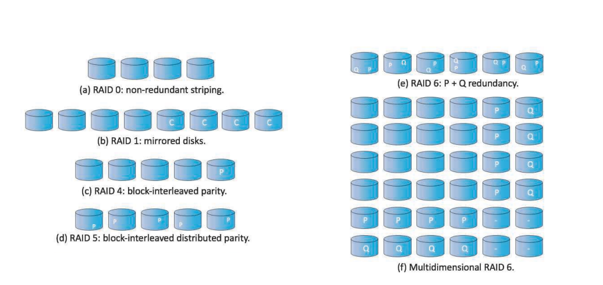
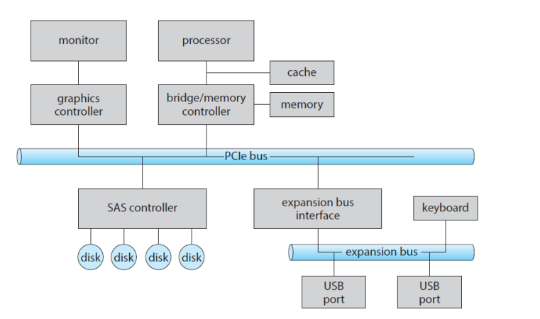

# Mass-Storage Structure

## Mass Storage

비휘발성 메모리(non-volatile), secondary system 

ex) HDD, NVM

## HDD scheduling

- access time 최소화 (or seek time)
- 데이터 전송의 bandwidth 최대화

**seek time**

device arm이 head를 움직이며, 특정 실린더의 특정 sector를 찾는데 걸리는 시간

**disk bandwidth**

한번에 transfer 할 수 있는 용량 / 전체 시간

### FIFO Scheduling

먼저 온 것부터 

640 만큼 헤더가 움직임

###  SCAN Scheduling

disk arm이 한쪽 끝에서 시작해 한쪽 끝으로 움직임

움직이면서 request 처리

### C-SCAN (circular scan)

to provide more uniform wait time

헤드를 한 방향으로만 움직이자! (왔다갔다x)

끝으로 가면 처음으로 되돌아감 -> 이때는 request에 대해서 어떤 sevice도 하지 않음

## Boot Block

bootstrap loader - 전원이 인가 됐을 때 컴퓨터를 구동시키기 위한 첫번째 프로그램 

이걸 nvm에 저장해놓고 운영체제 커널 로드

?

## RAID

데이터의 읽기 쓰기를 parallel

reliability향상

redundant information

- Redundancy 로 reliability 올리는 방법

  N개의 디스크에서는 오류 발생 확률이 높아짐

  중요한 데이터라면 redundancy를 줘서라도 reliability를 보장해야 함

  -> mirroring하기

  단점: 비쌈

  

- Parallelism으로 Performance 올리기

  데이터를 드라이브에 전송할 때 한번에 보낼 수 있음

  -> bit-level striping

  -> block-level striping

  단점: 효율적이지만 reliability 보장x

  

  **parity bit**

  1 -> 1의 비트가 짝수일 때 

  0 -> 1의 비트가 홀수일 때

  -> 전송오류 확인 가능 (비트가 손상됐는지 알 수 있음)

   

 ### RAID level

cost <-> performance (trade-off)

RAID 0 - not redundant striping

RAID 1 - mirror - 비용 많이 들어(2배)

RAID 4 - 4개의 데이터를 별도의 parity 비트로 저장

RAID 5 - 각 디스크에 parity 비트 줌

RAID6

다차원 RAID6

# I/O System

two main job of a computer - I/O and Computing

OS - I/O control, I/O device 관리

## Memory mapped I/O

메모리에 I/O 명령을 주면 control register의 역할 수행 가능

## Three types of I/O

- **polling (busy-waiting)**

  busy bit가 clear될 때 까지 반복적으로 status register를 읽음

- **interrupt**

  interrupt가 감지되면 ISR(interrupt service routine)한테 신호 넘겨줌

- **DMA**(direct memory access)

  데이터가 많을 때 사용 

## Blocking I/O VS Nonblocking I/O

Blocking I/O - a thread is suspended -> wating queue로 감

Nonblocking - 바로 return 

Asynchronous System Call - 실행을 계속 함

non-blocking 과의 차이점은 요청만 하고 바로 자기 할 일을 함 ( 뭔소리? )

# File System Interface

logical 하게 data와 program을 access

file

directory

## Access Method

## Allocation Method

