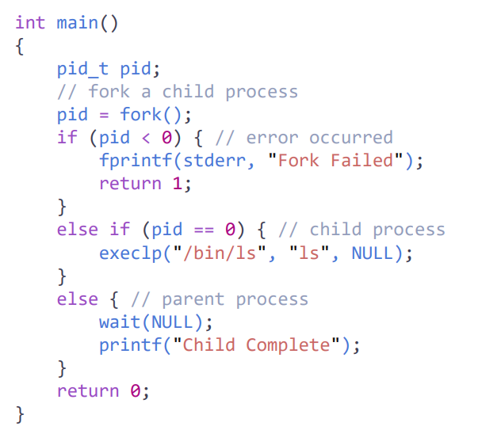

# Process

실행중인 프로그램의 인스턴스 (동적) - 상태를 가짐

프로그램 - 컴퓨터 파일에 저장된 실행 가능한 실행 파일 ( 정적)

멀티프로그램 시스템에 의해 각각의 프로세스는 독립적임

프로세스 실행을 위해 필요한 자원 - cpu time, memory, files, i/o device

- text section - code
- data section
- heap section
- stack section

## process state

- new
- running - cpu 점령
- waiting - 대기
- ready - 대기 후 점령 전 대기상태
- terminated - 끝난 상태

## PCB(Process controll block)

각 프로세스가 가진 정보를 PCB에 저장

process state, program counter (메모리에서 데이터 가져오고 저장하는 위치에 대한 정보)

CPU register, scheduling infotmation, accounting information 등

프로세스는  single thread( 실타래) execution

프로그램이 복잡해지면서 **multiple thread** -> multiprocessing 보다 장점이 많음

thread = lightweight process

## process scheduling

at the same time, simultaneously, concurrenty = 동시에 프로그램 처리

=> cpu utilization 높이기 위해

time sharing - 사용자 입장에서는 동시에 실행되는 것처럼 보임

### scheduling queue

ready queue - running - waiting queue (i/o 컴플리션 기다릴 때) - ready queue

### context switch

context = 프로세스의 state (PCB에 저장되어 있음) - 따라서 PCB 정보

- save 현재 프로세스(running process)의 상태 저장 - 어디까지 실행했는지, 

- restore 다시 실행될 떄 저장해놓은 정보를 복원

## operation in processes

fork() 를 통해 프로세스 생성

exit() 프로세스 종료

원래는 return하면 자동으로 끝남

- zombie process - 부모 프로세스가 wait() 안하고 계속 실행
- orphan - 부모 먼저 종료됨

## life & scope

프로그램이 메모리 공간을 차지하고 있으면 live

scope - 변수들의 acess 할 수 있는 프로그램 영역 (local, global)

## local variables

함수 안에 정의된 변수

함수가 끝나면 해당 변수에 대한 공간 사라짐

## Global variables

함수 외부에 정의된 변수

static한 공간 차지

프로그램 시작부터 끝까지 live

## Static variables

파일 내부에서 정의된 변수 - 파일 안에서만 사용 가능

static한 공간 차지

## Context switching

프로그램 실행 중에 다른 프로그램을 실행할 경우 기존 프로그램의 진행 state(context)의 를 save 해야 함

프로그램을 다시 시작할 때는 state 복구

어떤 프로그램을 선택할지 scheduling

