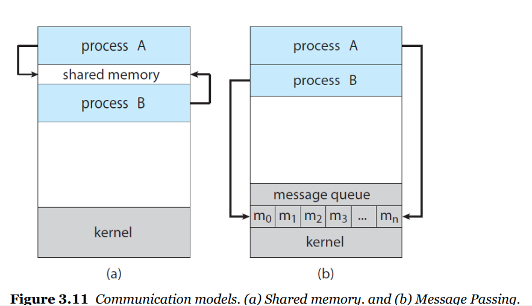

# 5. 프로세스간 통신

## Interprocess Communicarion

- independent processes

공유하는 데이터 x, 독립적

- cooperation processes

서로 영향을 주고 받음 , 데이터 공유**-->  IPC메커니즘 필요함**

### IPC ( Inter-process communication)

IPC의 두가지 모델

-  Shared memory -  공유 공간으로 통신
- message passing - 메세지 주고 받으며 통신, 운영체제한테 맡김

## Shared Memory system

### Producer - Consumer Problem

생산자는 정보 생산, 소비자는 정보 소비

ex)

컴파일러(생산자)가 어셈블리 코드 생산, 어셈블러(소비자)는 코드를 가지고 기계어 생산

웹 서버(생산자)는 html 파일 생성,요청 보내면 브라우저(소비자)는 전송

생산자 프로세스 - 소비자 프로세스

생산자 프로세스와 소비자 프로세스는 동시에 실행 됨

**buffer** - 생산자 프로세스는 buffer 채우고, 소비자 프로세스는 비우고

buffer가 shared memory -> 생산자 프로세스와 소비자 프로세스가 공유하는 공간

** 코드

생산자 프로세스는 buffer 채우고, in 증가 (가득차있으면 대기)

소비자 프로세스는 buffer 비우고, out증가

in하고 out이 같아질 때 까지 ( buffer가 빌 때 까지)

### shared memory 방식의 단점

 메모리 영역에 엑세스하는 것을 어플리케이션 프로그래머가 직접 관리해야함

-> message-passing 방식 활용 (운영체제가 관리하도록)

## message passing system

### communication links

send(message), recieve(message) - in,out 이런건 os에서 관리, 메세지만 던져줌

**message passing 방식 종류**

- direct  (메세지 직접 전달)
- indirect (매개체로 통신)

- synchronous (상태 보고 전달)

- asynchronous (알아서)

### direct communication

주고 받는 프로세스를 지정해줌

send(P,message) - P,Q 처럼 누구한테 주는지 명시

recieve(Q,message)

- communication link는 자동으로 생성
- 한 통신당 한개의 링크

### indirect communication

메일박스로 통신 - **port**

send(A,message) -A는 메일박스(port )

recieve(A,message)

- 두개의 프로세스가 포트를 공유할 때 링크 생성

- 하나의 링크에 두개 이상의 프로세스 공유 가능, 한 통신에 여러개의 링크 존재 가능

- os는 메일박스 (포트) 생성,삭제, 메일박스(포트)에 send receive 메세지 쓸 수 있도록

### Blocking send (synchronous)

sender는 receiver가 메세지를 다 받을 때 까지 대기(block)

receiver는 메세지가 port에 다 전송될 때 까지 대기(block)

- sender, reciever가 동기화되어 있음 (메세지 전송 상태 확인하고 다른 일),  느림

### Nonblocking send (asynchronous)

sender 메세지만 보내놓고 다른 일 함 (대기x) 

receiver는 메세지 받거나, 메세지가 없으면 null 리턴

- sender, reciever는 비동기(메세지 전송 됐는지 안됐는지 확인x),  효율적

