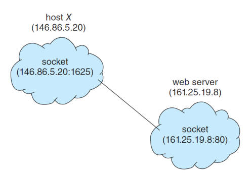

# 6. 프로세스간 통신의 실제

## shared memory - Posix shared memory

posix (portable operating system interface) - OS 표준

memory-mapped file 이용 - shared memory 파일을 memory에 생성

### producer process

```c
#include <stdio.h>
#include <stdlib.h>
#include <string.h>
#include <fcntl.h>
#include <sys/shm.h>
#include <sys/stat.h>
#include <sys/mman.h>
int main()
{
	const int SIZE = 4096; // the size of shared memory
	const char *name = "OS"; // the name of shared memory
	const char *message_0 = "Hello, ";
	const char *message_1 = "Shared Memory!\n";
	int shm_fd; // the file descriptor of shared memory
	char *ptr; // pointer to shared memory
    
	/* create the shared memory object */
	shm_fd = shm_open(name, O_CREAT | O_RDWR, 0666);
    
	/* configure the size of the shared memory */
	ftruncate(shm_fd, SIZE);
    
	/* map the shared memory object */
	ptr = (char *)mmap(0, SIZE, PROT_READ | PROT_WRITE, MAP_SHARED, shm_fd, 0);
    	# 메모리에 smd-fd영역 맵핑
    
	/* write to the shared memory */
	sprintf(ptr, "%s", message_0);
	ptr += strlen(message_0); # 포인터를 message0 길이만큼 옮김
	sprintf(ptr, "%s", message_1);
	ptr += strlen(message_1); # 포인터를 message1 길이만큼 옮김
        
	return 0;
}

```

### consumer process

```c
#include <stdio.h>
#include <stdlib.h>
#include <fcntl.h>
#include <sys/shm.h>
#include <sys/stat.h>
#include <sys/mman.h>
int main()
{
	const int SIZE = 4096; // the size of shared memory
	const char *name = "OS"; // the name of shared memory
	int shm_fd; // the file descriptor of shared memory
	char *ptr; // pointer to shared memory

	/* create the shared memory object */
	shm_fd = shm_open(name, O_RDONLY, 0666); # shm_fd로 shared memory 영역이 같음
    
	/* map the shared memory object */
	ptr = (char *)mmap(0, SIZE, PROT_READ | PROT_WRITE, MAP_SHARED, shm_fd, 0);
    
	/* read from the shared memory object */
	printf("%s", (char *)ptr); # ptr은 메세지를 가리킴
    
	/* remove the shared memory */ # 다 받으면 shared memory영역 삭제
	shm_unlink(name); 

	return 0;
}
```


## message passing - Pipes

unidirection(단방향) or bidirection(양방향)?

half duplex or full-duplex?

relationship이 필요한가?

network에서 쓸 수 있는가?

- ordinary pipes

  반드시 부모 - 자식 프로세스가 통신함

  두개의 파이프 필요 ( 양방향 통신을 위해 )

- named pipes

​	  부모 - 자식 관계 없어도 사용 가능

```c
#include <stdio.h>
#include <string.h>
#include <unistd.h>
#include <sys/types.h>

#define BUFFER_SIZE 25
#define READ_END 0
#define WRITE_END 1

int main() 
{
	char write_msg [BUFFER_SIZE] ="Greetings";
	char read_msg [BUFFER_SIZE];
	int fd[2]; # 하나는 read end(parent->child) 하나는 write end(child->parent)
	pid_t pid;
    
	/* create the pipe */
	pipe(fd);

    pid = fork(); // fork a new process
    
	if (pid > 0) { // parent process(producer)
		close(fd[READ_END]); # read 할 필요 없어서 close
		/* write to the pipe */
		write(fd[WRITE_END], write_msg, strlen(write_msg) + 1);
		close(fd[WRITE_END]);
	}
	else if (pid == 0) { // child process(consumer)
		close(fd[WRITE_END]); # write 할 필요 없어서 close
		/* read to the pipe */
		read(fd[READ_END], read_msg, BUFFER_SIZE);
		printf("read %s\n", read_msg);
		close(fd[READ_END]);
	}
	return 0;
}

```

## Communication in client-server system

오늘날의 네트워크 컴퓨터에서 컴퓨터끼리의 통신

 - sockets ( 컴퓨터와 컴퓨터 연결하는 파이프)

​		endpoints for communication 

​		IP  adress 와 port로 컴퓨터 특정 (ex http://.../8080)



- RPC (remote procedure calls)

​		프로세스들간의 원격 호출 추상화

### Sockets

#### Date server

```java
import java.net.*;
import java.io.*;

public class DateServer {
    
	public static void main(String[] args) throws Exception {
		ServerSocket server = new ServerSocket(6013);  # 포트번호 6013 서버소켓 생성
        
		/* Now listen for connections */
		while (true) {
			Socket client = server.accept();
			PrintWriter pout = new PrintWriter(client.getOutputStream(), true);
            
			/* write the Date to the socket */
			pout.println(new java.util.Date().toString());
            
			/* close the socket and resume listening for connections */
			client.close();
		}
	}
}

```

#### Data client 


```java
import java.net.*;
import java.io.*;

public class DateClient {
    
	public static void main(String[] args) throws Exception {
	/* make connection to server socket */
		Socket socket = new Socket("127.0.0.1", 6013); # ip,port
	
        InputStream in = socket.getInputStream();
		BufferedReader br = new BufferedReader(new InputStreamReader(in));

        /* read date from the socket */
		String line = null;
		while ((line = br.readLine()) != null)
			System.out.println(line);
        
		/* close the socket connections */
		socket.close();
	}
}

```

### RPC

원격지(네트워크로 연결된 서로 다른 pc)에 있는 함수 호출

A시스템에서 B에 있는 함수 호출 - stub 이용

데이터 정렬 - marshals
