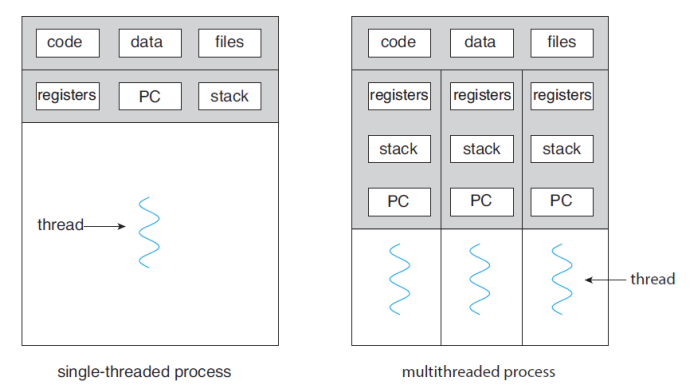
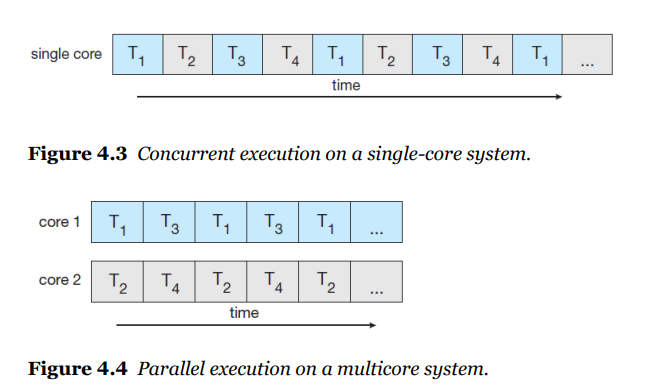
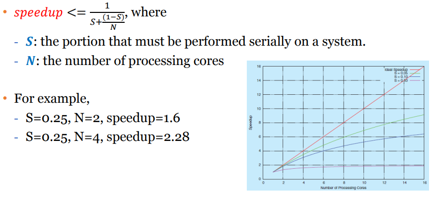

# Thread & Concurrency

하나의 프로세스는 여러개의 쓰레드를 가질 수 있음

**thread = lightweight process**



## 멀티쓰레딩의 장점

- responsiveness

  블락킹 없이 continue execution

- resource sharing

  같은 프로세스 내에 있기 때문에 리소스 공유 가능 (shared memory, message passing 필요 x)

- economy 

  하나의 프로세스 안에서 해결

- Scalability(확장성)

​		멀티프로세서 처럼 병렬 처리 가능

## creating thread in JAVA

- Inheritance

  쓰레드 클래스 상속, 그러나 자바는 다중상속이 안됨

- implementing

- using Lamda (익명 쓰레드) - 클래스 선언 x

### thread클래스 상속받기

```java
class MyThread1 extends Thread {
    
	public void run() {
		try {
			while (true) {
				System.out.println("Hello, Thread!");
				Thread.sleep(500);
			}
		}
		catch (InterruptedException ie) {
			System.out.println("I'm interrupted");
		}
	}
}

public class ThreadExample1 {
    
	public static final void main(String[] args) {
		MyThread1 thread = new MyThread1();
		thread.start();
		System.out.println("Hello, My Child!");
	}
}

```

### Runnable 인터페이스 구현하기

```java
class MyThread2 implements Runnable {
	public void run() {
		try {
			while (true) {
				System.out.println("Hello, Runnable!");
				Thread.sleep(500);
			}
		}
		catch (InterruptedException ie) {
			System.out.println("I'm interrupted");
		}
	}
}

public class ThreadExample2 {
	public static final void main(String[] args) {
		Thread thread = new Thread(new MyThread2());
		thread.start();
		System.out.println("Hello, My Runnable Child!");
	}
}

```

### Runnable 람다 표현식 사용하기

```java
public class ThreadExample3 {
	public static final void main(String[] args) {
		Runnable task = () -> {
			try {
				while (true) {
					System.out.println("Hello, Lambda Runnable!");
					Thread.sleep(500);
				}
			}
			catch (InterruptedException ie) {
				System.out.println("I'm interrupted");
			}
		};
		Thread thread = new Thread(task);
		thread.start();
		System.out.println("Hello, My Lambda Child!");
	}
}

```


## Multicore Programming

** 4개의 thread가 있을 때 (single core vs milticore)



### 멀티코어 시스템의 programming challenge

- identifying tasks - - 어떤 task가 나눠질 수 있는지, 어떻게 병렬로 구현할 수 있을지 결정
- balance - task 균형 맞추기
- data splitting - 데이터 적절하게 나누기
- data dependancy - 실행할 때 동기화 어떻게 할지 고려
- testing and debugging - 싱글 쓰레드에 비해 테스트와 디버깅이 어려움


### 병렬처리 종류

- data parallelism
- task parallelism

지금은 둘다 필요 없음 -  분산처리(hadoop) 하기 때문에

### Amdahl's Law

코어는 무조건 많을 수록 좋은지?

s = 직렬로 처리해야 하는 비율, p = core의 개수

직렬로 처리해야하는 task의 비율이 높으면 core 수가 많아도 소용 없음