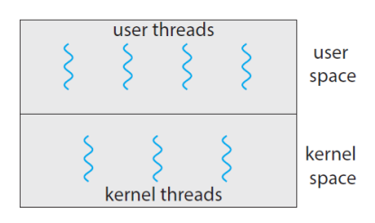
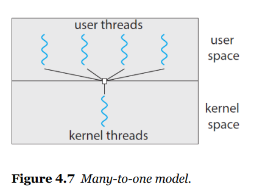
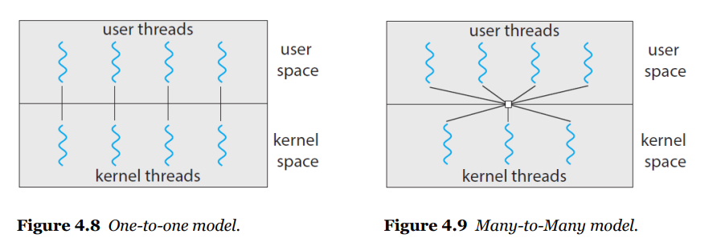

# Multi threading

## multi threading model

- user thread

​	user mode에서 쓰레딩

- kernel thread

​	kernel mode, 운영체제가 관리

## relationship

- many to one - 커널 쓰레드 1개 to 여러 유저 쓰레드 ( 가장 기본적)

- one to one 

- many to many

  

  

  

## Thread Libraries

쓰레드를 생성하고 관리하는 라이브러리(api)

- POSIX Thread (Pthreds)

- windows thread

- Java thread

  

## Implicit Threading

concurrent and parallel 구현해야해서 어려움

-> compiler 나 library가 알아서 해줘

- **thread pools** - 여러개의 쓰레드를 pool에 저장하고 꺼내서 씀
- **fork & join** - explicit threading -> implicit threading

- **open MP**

​		컴파일러 지시어를 통해 c/c++에서 병렬처리 할 수 있도록

### open MP

컴파일러한테 지시하기 - 컴파일러한테 병렬 처리할 부분 알려주면 병렬 처리하는 thread 만들어줌