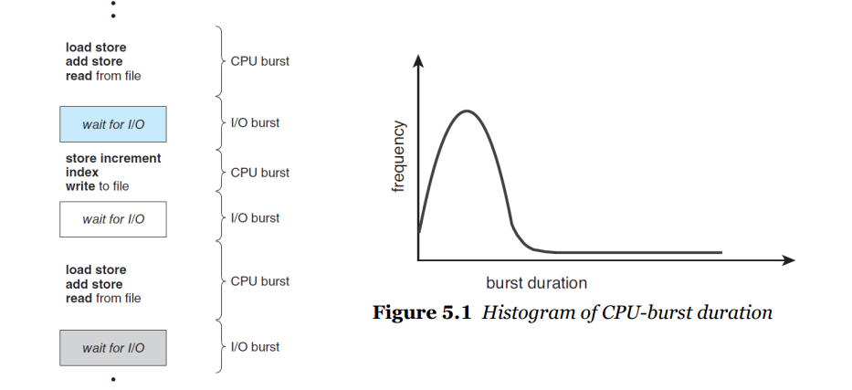
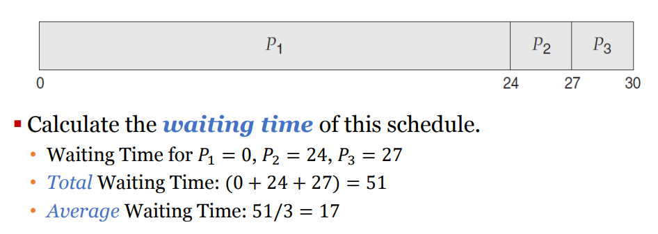
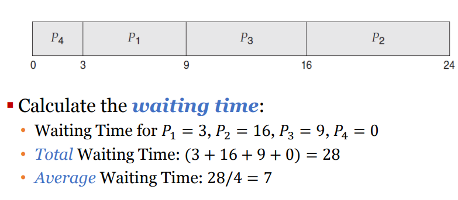

# CPU scheduling

멀티프로그래밍의 기본

I/O burst가 더 지배적

## CPU scheduler

레디 상태에 있는 프로세스들 중에서 cpu에 할당할 프로세스 선택

- FIFO Queue - 차례대로
- Priority Queue - 우선순위 부여

## preemptive(선점형) vs non-preemptive(비선점형) kernel

preemptive - 프로세스 강제 종료

non-preemptive - 프로세스가 자발적으로 종료할 때까지 기다림

**4가지 경우

1. running -> waiting (non-preem)
2. running -> ready (preemptive, non-preemptive 둘중 선택)
3. waiting -> ready(preemp, non 둘중 선택)
4. terminates (non-preem)

## dispatcher

CPU control을 넘겨주는 것

context switching을 해주는 모듈 (CPU scheduler는 선택, 실제 실행은 dispatcher)

dispatcher는 가능한 빨리 동작해야함

## 스케쥴링의 목표

- CPU utilization - CPU효율
- throughput - 단위시간 내 완료되는 프로세스의 수 높이기
- turnaround time - 실행~종료 시간 최소화
- **waiting time** - ready queue에서 대기하는 시간 최소화
- response time - UI에서 중요

## 스케쥴링 알고리즘

ready queue에 있는 프로세스 중 어떤 프로세스가 cpu를 선점하게 할 건지 선택

### FCFS(First come, First served)

non-preemptive

들어온 순서대로 처리 (먼저 요청한 프로세스부터) , FIFO queue이용

waiting time 너무 길어

convoy efferct (똥차효과) - Big process가 앞에 있으면 뒤에 process 는 다 밀림

--> 효율이 안좋앙

### SJF (Shortest Job First)

남은 시간이 가장 짧은 것 부터 - next CPU burst 작은 것부터

FCFS에 비해 waiting time, turnaround time 줄어듬

### RR(Round-Robin)

time sharing 

정해진 시간 만큼만

### Priority - based

RR+ 우선순위 부여

### MLQ( Multi-Level Queue)

### MLFQ( Multi-Level Feedback Queue)

