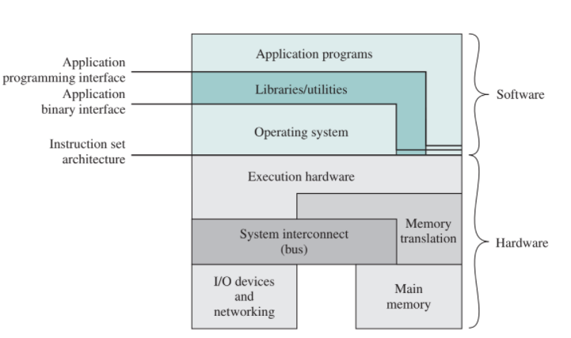

# OS

하드웨어와 어플리케이션 사이에 있는 시스템 소프트웨어

목적

- 사용을 편리하게 - Low level function 제공
- sharing - 프로세서 동시 실행될 때 CPU memory들의 여러 프로세스를 sharing
- 잘못된 사용 방지 - Low level function은 다 제공하니까 건드릴 이유 x

모든 컴퓨터 시스템에는 os가 들어감 - 프로그램이 실행중이면 다 컴퓨터 시스템 

컴퓨터 시스템은 메모리와 레지스터가 명령어를 실행하며 동작함  -명령어를 실행할 때 마다 스테이트(메모리와 레지스터의 상태)가 바뀜

 

ISA - 모든 컴퓨터는 자기만의 언어(기계어) 를 가짐 x86, ARM

API - 프로그램에서 라이브러리 블러오기

## Simple Betch System

최초 운영체제

사용자는 펀치 카드에 프로그램을 작성한 후 컴퓨터에 입력

프로그램 순서대로 처리 - 하나 끝나면 다음 프로그램 시작

GM 엔지니어에서 개발

인풋 아웃풋이 계속 반복됨 - 시간이 오래걸림

## Multiprogrammed Betch System (멀티태스킹)

하나의 프로그램 실행 중에 다른 프로그램 실행 가능

## Time Sharing System

여러 사용자가 터미널을 통해 하나의 컴퓨터 시스템의 공유

멀티 태스킹 시스템 적용

reponse time이 중요해짐

현재 실행되는 프로그램이 잠깐 중지될 때는 현재 상태를 레지스터에 저장

