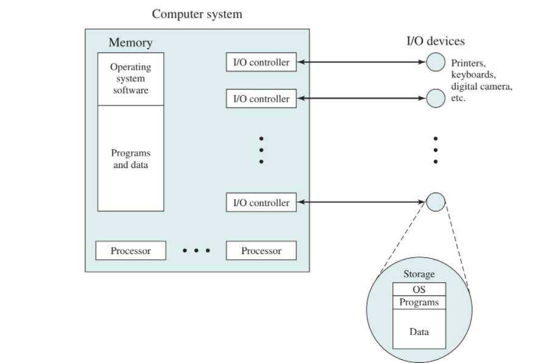

## OS

하드웨어와 어플리케이션 사이에 있는 시스템 소프트웨어

목적

- 사용을 편리하게 - Low level function 제공
- sharing - 프로세서 동시 실행될 때 CPU memory들의 여러 프로세스를 sharing
- 잘못된 사용 방지 - Low level function은 다 제공하니까 건드릴 이유 x

모든 컴퓨터 시스템에는 os가 들어감 - 프로그램이 실행중이면 다 컴퓨터 시스템 

컴퓨터 시스템은 메모리와 레지스터가 명령어를 실행하며 동작함  -명령어를 실행할 때 마다 스테이트(메모리와 레지스터의 상태)가 바뀜

 


```
13
W 30 1
S 50 2
W 40 2
S 100 4
W 200 1
S 50 1
W 400 7
S 100 8
S 200 8
S 300 8
S 100 6
W 10 12
```

